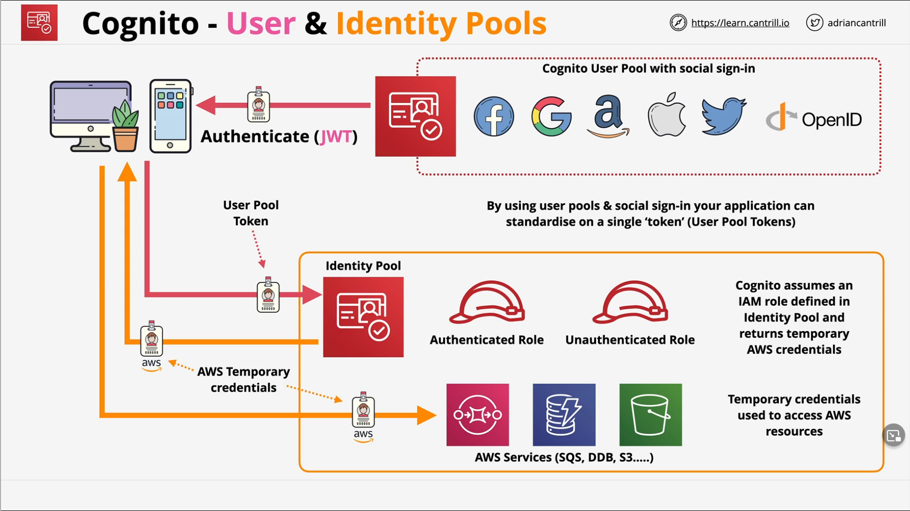

* Cognito has terrible naming!
* Service provides authentication, authorization, and user management for web/mobile apps.
* USER POOLS - Sign in and get a JSON web token (JWT). 
  * Most AWS services cannot use JWTs. User pools don't grant access to AWS services.
  * User Directory management and profiles, sign up, sign in, MFA, and other security features.
  * Can use JWT for self managed server based resources or API gateway.
* IDENTITY POOLS - Allow you to offer access to Temporary AWS Credentials
  * Unauthenticated Identities - Guest Users
  * Federated Identities- SWAP Google, Facebook, Twitter, SAML 2.0, and User Pool identities for short term AWS Credentials to access AWS resources.
* User Pool JWTs cannot be used to access AWS resources. That requires AWS credentials via Identity Pools.

