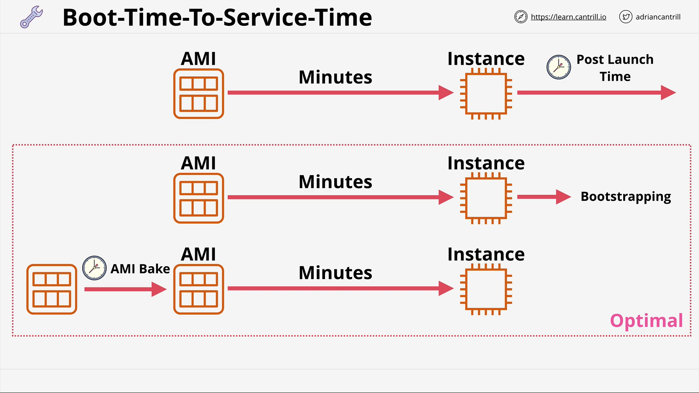

# Bootstrapping via User Data

Bootstrapping is the process where scripts or other bits of configuration can be run when an instance is first launched. This means an instance can be brought into service in a certain pre-configured state. Instead of launching an instance with an AMI and having it be in its default state, we can bootstrap in a certain set of configurations or software installs.

Bootstrapping in general is aprocess which allows a system to self-configure or perform some self-configuration steps.

- Boostrapping allows for EC2 Build Automation
- With EC2, bootstrapping is enabled using User Data. It is accessed using the meta-data IP: http://169.254.169.254/latest/user-data
- Anything in User Data is executed by the instance OS (as the root user).
- ONLY once at launch. It's for launch time configuration only.
- EC2 doesn't interpret, the OS needs to understand the User Data.

The user data is just passed in via EC2 and the instance has software on it to check the user data on launch and will run it before being ready for service.

If there is a problem with the user data, you will have a badly configured instance. However, unless the script did something terribly bad (like delete mass amounts of OS data), it is still likely that the instance will pass its status check and simply go into a running state and appear normal.

You passin the instance user data as a block of data. Either it runs successfully or not. To EC2, it is opaque data, just a block of data to pass in.

Furthermore, user data is **not** secure. It shouldn't be used for passwords or long term credentials.

User data is limited to 16KB in size. For anything more complex, you'll want to pass in a script that downloads more data to run.

Can be modified when instance is stopped. However, it is only executed once at launch. After the launch state, it is only really useful for passing data into the instance, and there are better ways of doing that.

