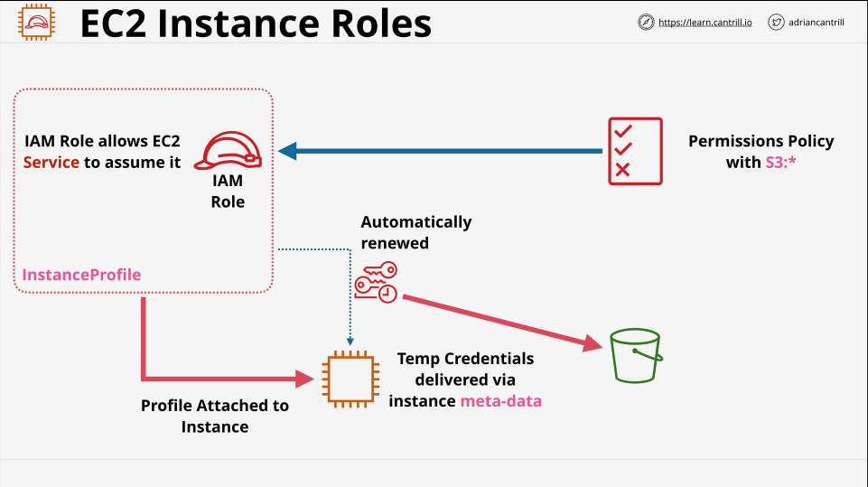

# EC2 Instance Roles

Instance roles and instance profiles are how applications running on an EC2 instance can be given permissions to access AWS resources on your behalf. The instance can assume the role and anything running in that instance has the permissions of that role then.

Short term temporary credentials are available via the EC2 Instance Metadata and are renewed automatically by the EC2 and STS services.

- Credentials are inside EC2 meta-data

- IAM/Security credentials/Role name

- Automatically rotated - always valid

- Should always be used rather than adding access keys into the instance.

- CLI tools will use role credentials automatically.

## Architecture

