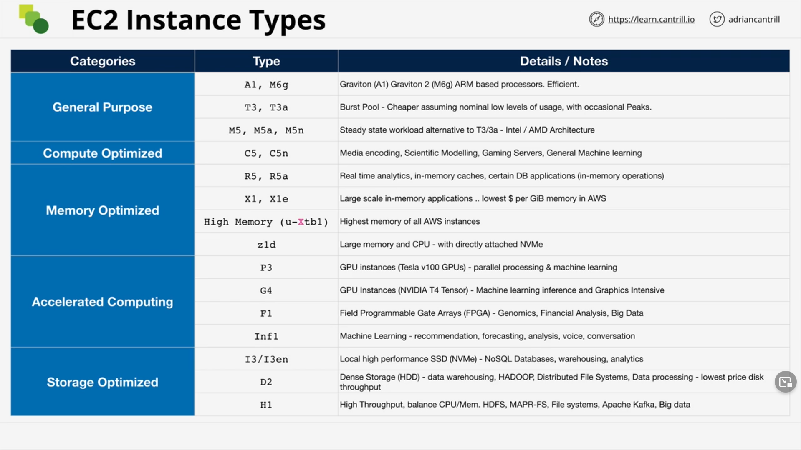

Influences

* Raw CPU, memory, local storage capacity, and type
* Resource Ratios
* Storage and Data Network Bandwith
* System Architecture / Vendor (i.e. ARM vs x86)
* Additional Features and Capabilities

Categories

* General Purpose - Default - Diverse workloads, equal resource ratio.
  * Should be the starting point.
* Compute Optimized - Media Processing, High performance computing, Scientific Modelling, gaming, machine learning.
* Memory optimizing - Processing large in-memory datasets, some database workloads.
* Accelerated Computing - Hardware GPU, field programmable gate arrays (FPGAs).
* Storage Optimized - Sequential and Random IO - scale-out transactional database, data warehousing, Elasticsearch, analytic workloads.

Decoding EC2 Types

* Example: R5dn.8xlarge
  * Whole thing is the instance type
  * R = Instance Family
  * 5 = Instance Generation
    * Generally, always select the most recent generation.
  * dn = Additional Capabilities
    * a = amd cpu
    * d = nvme storage
    * n = network optimized
    * e = extra capacity (ram or storage)
  * 8xlarge = Instance Size
    * There is often a price premium on the higher end. It is often better to scale systems with larger amounts of smaller instances.

* https://aws.amazon.com/ec2/instance-types/
* https://instances.vantage.sh/
