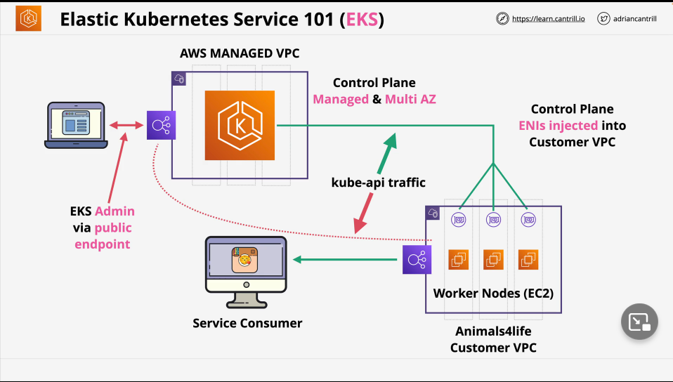

Amazon Elastic Kubernetes Service (EKS) is a fully managed, Kubernetes implementation that simplifies the process of building, securing, operating, and maintaining Kubernetes clusters on AWS.

## Overview

- Open source & Cloud agnostic
- Can run on AWS itself, AWS Outputs (tiny version of AWS on-premises), EKS Anywhere (EKS clusters on premises), or EKS Distro.
- Control plane scales and runs on multiple AZs.
- Integrates with AWS services (ECR, ELB, IAM, VPC, etc.)
- EKS Cluster = EKS Control Plane & EKS Nodes
- etcd distributed across multiple AZs
- Nodes: Self Managed, Managed node groups, or Fargate pods.
    - Deciding between these three will be based on your requirements.
    - If you need Windows, GPUs, Inferentia, Bottlerocket, Outposts, Local zones, etc...check the node type.
- Storage providers: Include EBS, EFS, FSx Lustre, FSx for NetApp ONTAP.

