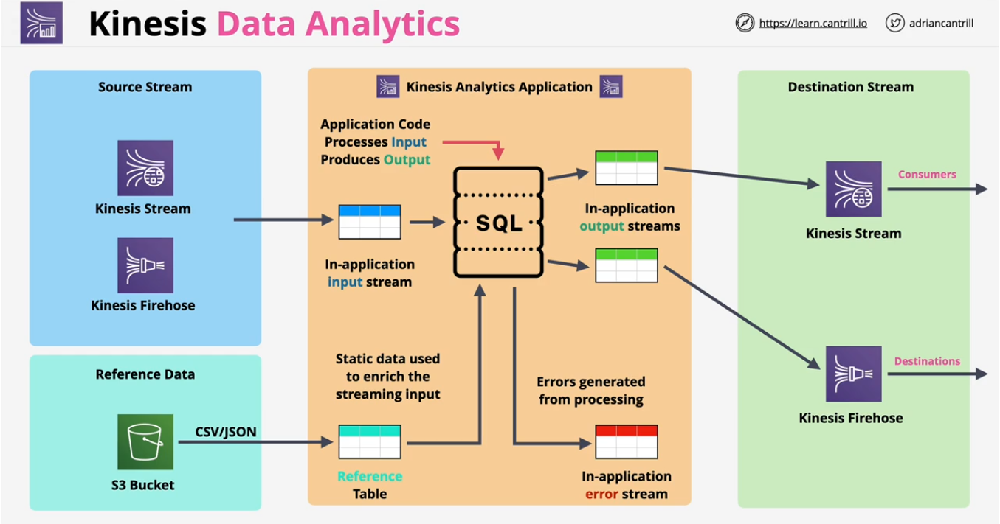

* Real-time processing of data
* Uses SQL
* Ingests from Kinesis Data Streams or Firehose

Destinations

* Firehose (and destinations Firehose supports but the delivery becomes near real time)
* AWS Lambda
* Kinesis Data Streams

Use cases

* Streaming data needing real-time SQL processing
  * Time-series analytics (elections, e-sports)
  * Real-time dashboards (leader boards for games)
  * Real-time metrics (security and response teams)

