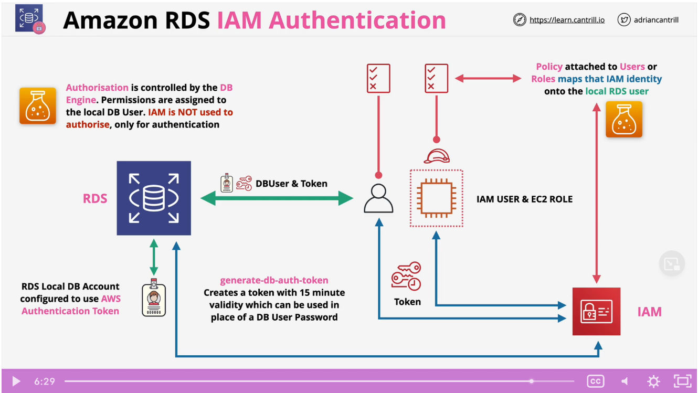

* SSL/TLS (in transit) is available for RDS, can be mandatory.
* RDS supports EBS volume encryption - KMS
  * Handled by HOST and EBS storage (RDS engine just thinks it is writing plaintext to storage but the data is encrypted by the host the RDS instance is running on)
  * AWS or Customer Managed CMK generates data keys.
  * Data keys used for encryption operations.
  * Storage, logs, snapshots, and replicas are encrypted.
* Encryption cannot be removed once it is added.
* RDS MSSQL and RDS Oracle support Transparent Data Encryption (TDE).
  * Encryption is handled within the DB engine.
  * Assurance that data is secured the moment is it written out of the database engine
* RDS Oracle supports integration with CloudHSM
  * Much stronger key controls (even from AWS)
  * Can have no trust chain that involves AWS

