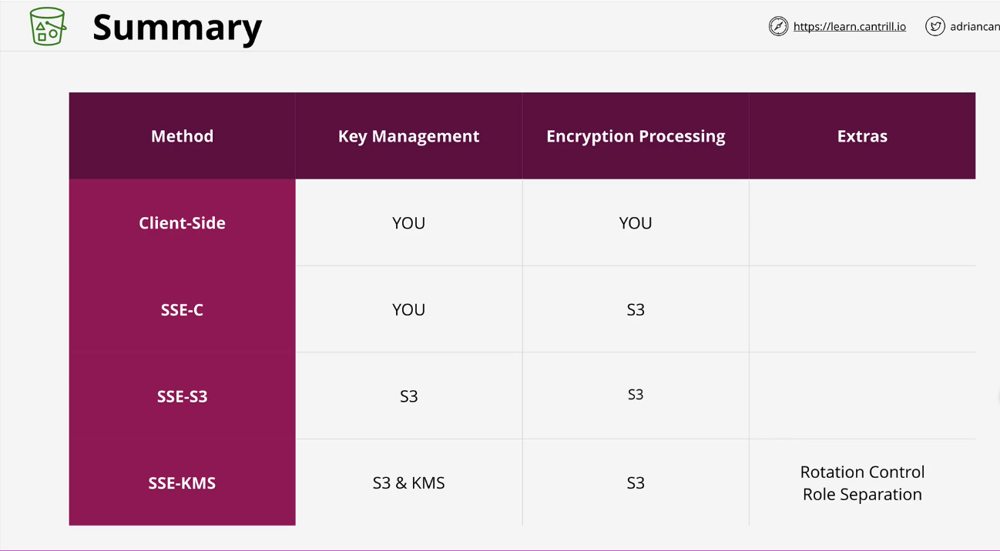

* **Buckets aren't encrypted, objects are**

* When we talk about S3 Encryption, we're focused on encryption at rest and not talking about in transit, which comes standard with S3.

* Client-side Encryption
  
  * Objects being uploaded are encrypted by the client and are ciphertext the whole way through.
  * Only one that ever sees the original data. You have full control, but you also have to manage the keys and encryption.
* Server-side Encryption
  
  * While it is encrypted in the encryption tunnel during transit, it arrives at the S3 endpoint in plaintext. Then it is encrypted by the S3 infrastructure.

Server-side Encryption with Customer-Provided Keys (SSE-C)

* User is responsible for managing encryption keys
* S3 service manages encryption
  * Need to provide object and the encryption key that will be utilized when doing a PutObject
  * S3 takes hash of the key as a safety feature so that when you provide the key for decryption, you're providing the same key. The key is then discarded.
  * To decrypt, need to provide the correct key and object to decrypt.

Server-side Encryption with Amazon S3-Managed Keys (SSE-S3, AES-256 algorithm)

* AWS handles encryption and decryption process as well as the management of the keys. With this method, the only thing you provide to S3 is the plaintext data.
* AWS will then create a master key for these encryption that you do not have control over and whose rotation is managed by AWS.
* S3 generates a data key specifically for the one PutObject and uses that key to encrypt the one object. Then the master key is used to encrypt the data key and the original plaintext version is discarded. The ciphertext of the object and key are then stored in S3 storage.
* If we're in a regulatory environment where you need to do any of the following, this will not be suitable.
  * Control the keys that are used and control access to them.
  * Control the rotation of the key material.
  * If you need role separation (with this, a full S3 administer can decrypt and view data).

Server-side Encryption with Customer Master Keys (CMKs) Stored in AWS Key Management Service (SSE-KMS)

* AWS handles key and encryption process (similar to SSE-S3), however, KMS is used to handle the master key.
* AWS-managed customer master key is created when an object is uploaded for the first time. Then a data encryption key is created for each object needed to be encrypted. However, you don't have to use this default and can instead use a customer-managed CMK, which means we can control permission and rotation of the key. We can also have logging and auditing on the CMK itself.
* Even if someone has full S3 permissions, they may not have permissions on the CMK then and therefore cannot read any of the objects inside of the bucket.

x-amz-server-side-encryption is the header used to tell AWS we want the object to be encrypted (AES256, aws:kms). You can also set the default for the bucket which means it will be used when you don't set something on the object level. This is just a default, you can override it. You can specify on a bucket policy which types of encryption are allowed to be used however.
