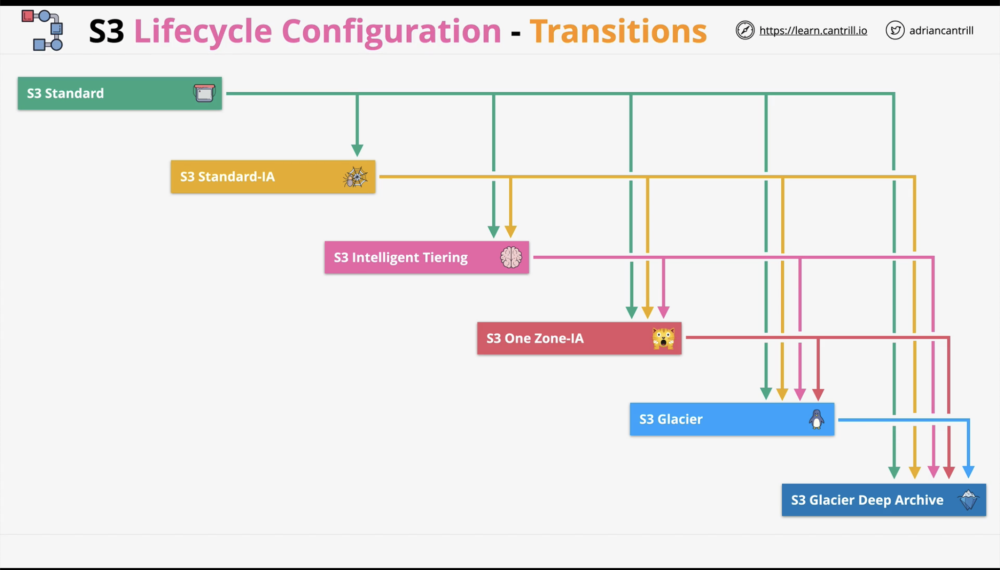

* Set of rules that consist of actions that are applied to a bucket or groups of objects inside a bucket. These rules are *not* based on access (only intelligent tiering can do that on our behalf).
* Transition actions (change storage class)
* Expiration Actions (delete objects or versions)

* Smaller objects can **cost more** when transitioning downward (because of minimum size restrictions).
* 30 day minimum on S3 standard before transition to any of the infrequent access tiers.
* A single rule cannot transition to Standard-IA or Intelligent-tiering or One Zone-IA and THEN to either glacier type within 30 days (duration minimums).

Lifecycle rules

* Scope
* Action
  * Between different storage classes
  * Expire versions
  * Permanently delete previous versions
