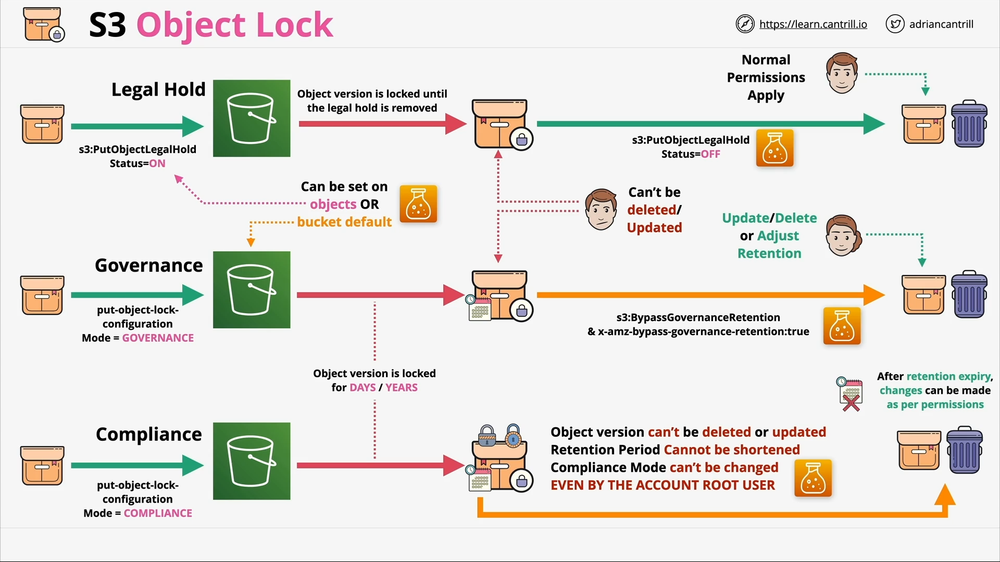

# Object Lock

Object Lock can be used to store objects use a _write-once-read-many_ (WORM) model. It can help you prevent objects from being deleted or overwritten for a fixed amount of time or indefinitely. This can be used to meet regulatory requirements that require WORM storage or add an extra layer of protection against object changes and deletion.

Object lock is more of a grouping of features than a particular thing.

## Constraints

- Object Lock can only be enabled on new buckets (for existing buckets, you need to contact AWS support to enable it).

- Once you enable Object Lock, versioning is also enabled on that bucket, and you cannot disabled it or suspend versioning.

- Write-Once-Read-Many (WORM) - No delete, no overwrite.'

- Requires versioning - individual versions are locked.

## Object Retention

Retention period or legal holds. An object can have both of these, one, the other, or none.

A bucket can have default object lock settings or be defined on individual object versions.

### Retention Period

When you create the object lock, you specify the retention period in days or years.

Modes:
  - **Compliance**: Object cannot be deleted or overwritten for the duration of the retention period and also means the retention period itself can't be adjusted, deleted, or overwritten (even by the account root user). This is the most strict form of object lock. You'd use this mode for compliance reasons, for instance, with medical or finance requirements.
  - **Governance**: Set a retention period and then objects cannot be deleted or changed in anyway. However, you can grant special permissions to allow lock settings to be adjusted: s3:BypassGovernanceRetention and x-amz-bypass-governance-rentention:true (default for console UI) header is provided. Useful for preventing accidental deletion, governance reasons, or a test of settings before picking compliance mode.

### Legal Hold

No concept of retention. It is either on or off for an object version. While on, no deletes or changes can be made until the legal hold is removed.

- Requires s3:PutObjectLegalHold to add or remove
- Prevent accidental deletion of critical object versions (for instance, for a given legal case)

