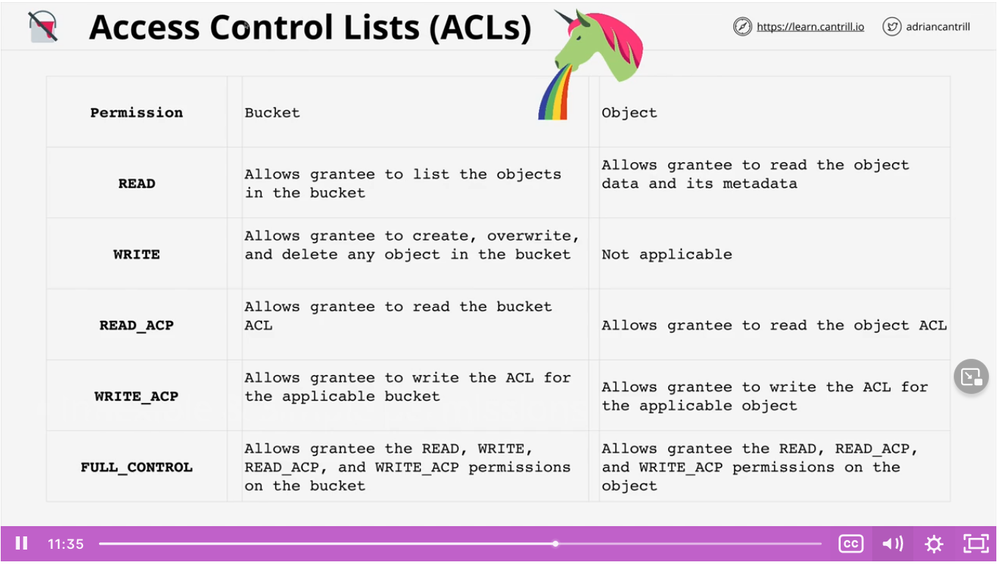

S3 is private by default.
The only identity that has any permissions is the account root user from the account that created the bucket. Any other permissions have to be explicitly granted.

## Bucket Policies

* A form of resource policy
* Like identity policies but attached a bucket (resource)
* Resource perspective permissions ()
* ALLOW/DENY same or different accounts.
* ALLOW/DENY anonymous principals.

Identity policies can only be attached to identities in your own account. However, resource policies allow access within the same account or different account.

Only one bucket policy on a bucket but it can have multiple statements.

For anonymous principals, only the bucket policy would apply since no identity policies would be able to be applied.

For cross account identities trying to access the bucket, the identity policies in their account applies and the bucket policy applies. So they would need to ensure that the identity policy in their account grants them the specific S3 action as well as the bucket policy.

## Access Control Lists (ACLs)

* ACLs on objects and buckets
* A sub resource
* Legacy, AWS recommends preferring bucket policies or identity policies
* Inflexible and simple permissions (no conditions like bucket policies)
  * Either on the bucket or on an object. Cannot use single ACL on group of objects.

## Block Public Access

* In response to misconfigurations and public mistakes from companies that led to data leaks
* Applies only to anonymous
* Overrides resource policy, no matter what the resource policy says, this will override it for public access on anonymous principals.

## Exam Powerup

* Identity: Controlling different resources
* Identity: You have a preference for IAM
* Identity: Same Account
* Bucket: Just controlling S3
* Bucket: Anonymous or Cross-Account
* ACLs: Never -- unless you must.
