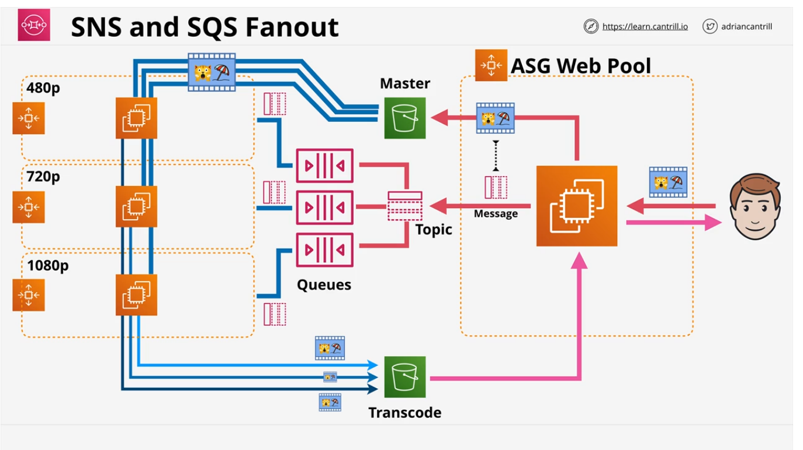

SQS queues are a a managed message queue service in AWS which help to decouple application components, allow Asynchronous messaging or the implementation of worker pools.

* Public service
* Highly Available
* Fully managed
* Standard or FIFO

Messages up to 256KB in size - can link to larger data (in something like S3).

Messengers can send messages to that queue and consumers can poll that queue for messages. When a client polls and receives a message, the messages are actually hidden and not removed yet. The VisibilityTimeout is the amount of time a client can take to process the message. When done, the client can explicitly delete the message off the queue. If the client doesn't, then the message will reappear.

Dead-letter queues can be used for problem messages. If a message is received X or more times and not deleted, it can be moved to this queue.

Auto-scaling groups can scale and Lambdas invoke based on queue length. 

Standard = at least once delivery (no guarantee on order of delivery)

* Scale in a much more linear way
  FIFO = exactly once delivery
* Performance: 3000 messages per second with batching or up to 300 messages per second without

Billed based on 'requests'

* 1 request = 1-10 messages up to 256KB total
* Short (immediate) vs Long (waitTimeSeconds, up to 20 seconds, will sit and wait if none currently exist) Polling

Encryption at rest (KMS) & in-transit

* Access to a Queue is based on identity policies or queue policies (only access from external accounts for queue policies, regular resource policy)
