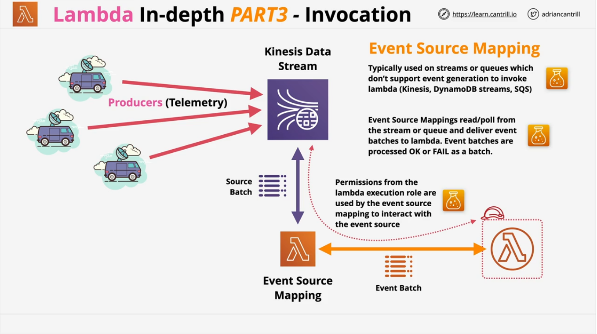

* Functions as a service (FaaS) - short running & focused
* Lambda function - a piece of code lambda runs
* Functions use a runtime (e.g. Python 3.8)
* Functions are loaded and run in a runtime environment
* The environment has a direct memory (indirect CPU) allocation
* You are billed for the duration that a function runs
* A key part of Serverless architectures
* Stateless (no data is conserved from each invocation, not 100% true but need to think of that way architecturally)
* You directly control the memory allocated for Lambda functions where vCPU is alllocated indirectly.
* 512MB storage available as /tmp
* Lambda functions can run up to 900s (15 minutes) until a function timeout (can use step functions to break tasks up)
* Security for a lambda function is controlled using execution roles
* Event driven service

Deployment package

* Define language
* Give deployment package

Docker is not supported (anti pattern) for the exam. Custom runtimes such as Rust are possible using layers

Common uses

* Serverless applications (S3, API Gateway, Lambda)
* File processing (S3, S3 events, Lambda)
* Database triggers (DynamoDB, Streams, Lambda)
* Serverless CRON (Eventbridge/CWEvents + Lambda)
* Realtime Stream Data Processing (Kinesis + Lambda)

Lambda Networking Modes

* Public (default)
  * By default, lambda functions are given public networking. They can access public AWS services and the public internet.
  * Offers the best performance because no customer specific VPC networking is required
  * Any lambda functions running in this default have no access to VPC based services unless public IPs are provided AND security controls allow external access
* VPC Networking
  * Lambda functions running in a VPC obey all VPC networking rules
  * Freely access other VPC resources
  * Cannot access things outside of VPC unless networking configuration exists that allows so (i.e. DynamoDB or public internet sites)
  * Could use VPCE (VPC endpoint) to access DynamoDB (VPC endpoints can provide access to public AWS services)
  * Could use NATGW or Internet Gateway for VPC lambdas to access internet resources
  * Needs EC2 network permissions (?)
  * Lambda + VPC (look into more, part 2)

Security

* Lambda execution roles are IAM roles attached to lambda functions which control the PERMISSIONS the Lambda function RECEIVES
* Lambda resource policy controls WHAT services and accounts can INVOKE lambda functions

Logging

* Uses cloudwatch, cloudwatch logs, and X-ray
* Logs from Lambda executions - Cloudwatch Logs
* Metrics - invocation success/failure, retries, latency, stored in CloudWatch
* Lambda can be integrated with X-Ray for distributed tracing
* Cloudwatch Logs requires permissions via Execution Role

Invocation

* Synchronous invocation
  * CLI/API invoke a function, passing in data and waits for a response. Lambda function responds with data or fails
  * Client communicates with APIGW, proxied to lambda function, lambda function responds or fails, response back to client.
* Asynchronous invocation
  * Typically used when AWS services invoke lambda functions.
  * S3 Event PUT -- S3 doesn't wait for any kind of response. The event is generated and S3 stops tracking.
  * If processing of the event fails, lambda will retry between 0 and 2 times (configurable). Lambda handles the retry logic.
  * The lambda functions needs to be idempotent reprocessing a result should have the same end state.
  * Events can be sent to a dead letter queues after repeated failed processing.
  * Events processed by lambda functions can be delivered to separate destinations (SQS, SNS, Lambda & EventBridge) where successful or failed events can be sent.
* Event source mappings
  * Typically used on streams or queues which don't support event generation to invoke lambda (Kinesis, DynamoDB streams, SQS)
  * Source batches retrieve from Kinesis data stream and sent to lambda function as an event batch (control batch size for 15 minute timeout).
  * Event source mappings read/poll from the stream or queue and deliver event batches to lambda. Event batches are processed OK or FAIL as a batch.
  * The event source mapping uses permissions from the lambda execution role to interact with the event source (so the role needs permissions to read from event source, even if the lambda doesn't interact with it directly)
  * SQS queues or SNS topics can be used for any discarded failed event batches.

Versions

* Possible to determine specific versions of a particular functions
* A version is the code + the configuration of the lambda function
* It's immutable - it never changes once published & has its own ARN
* $Latest points at the latest version
* Aliases (DEV, STAGE, PROD) point at a version - can be changed.

Startup times

* Runs inside a runtime environment (execution context)
* When first invoked, the context needs to be created and invoked.
* An execution context is the environment a lambda function runs in. A cold start is a full creation and configuration (~100ms) including function code download.
* With a warm start, the same execution context is reused. A new event is passed in but the execution context creation can be skipped (~1.2ms).
* A lambda invocation can reuse an execution context but has to assume it can't. If used infrequently contexts will be removed. Concurrent executions will use multiple (potentially new) contexts.
* Provisioned concurrency can be used. AWS will create and keep X contexts warm and ready to use..improving start speeds.
* Can use /tmp for caching
