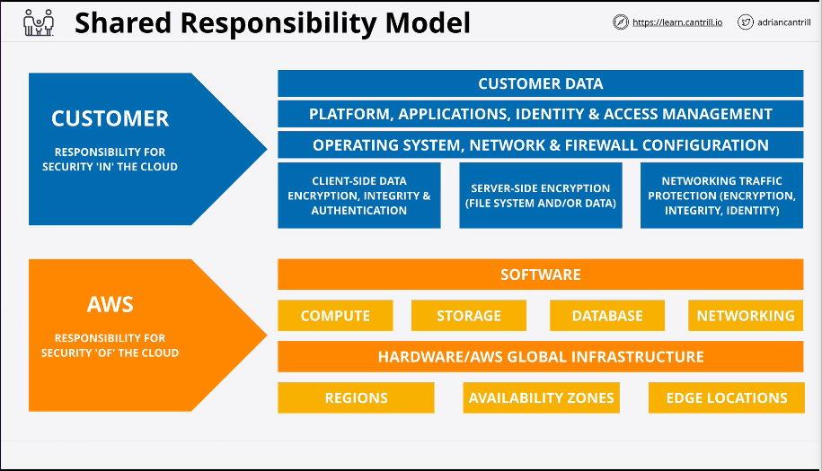

AWS

* Responsibility for the security 'of' the cloud
* Manages regions, availability zones, edge locations, hardware/global infrastructure, compute, storage, database, networking, software.

Customer

* Response for security 'in' the cloud
* Client-side data encryption, integration, authentication.
* Server side encryption
* Network traffic protection
* OS, network, firewall configuration
* Platform, applications, identity and access management
* Customer data

