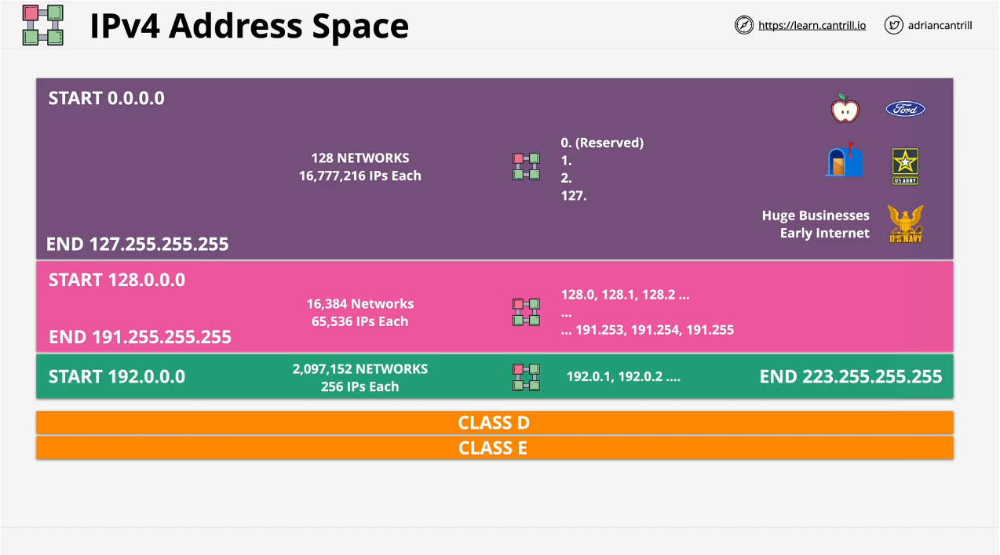

# IP Addressing

## IPv4

- IPv4 standard created in 1981 via the RFC791 document.
- 0.0.0.0 -> 255.255.255.255 = 4,294,967,296 Addresses.
- Originally, directly managed by IANA (Internet Assigned Numbers Authority).
- Now, parts are delegated to ergional authorities (such as RIPE, ARIN, APNIC).
- All public IPv4 addressing is allocated (so you have to be allocated them in order to use them). You can't pick a random address and expect it to work on the public internet without significant issues.
- Parts of the address space is private and can be used/reused freely.
  - These are the addresses that are generally used within home networks, business networks, and cloud platforms (such as AWS or Azure).

### Classes

#### A

Generally used for huge networks and were used for large businesses that had a early internet presence (i.e. Apple, Ford, USPS, US Military, etc.). Many of these organizations have since given up the ranges and they are now allocated to regional managers of the IP address space.

Start: 0.0.0.0
End: 127.255.255.255

128 Networks
16,777,216 IPs Each

0.(Reserved)
1.anything
2.anything
127.anything

First octet denotes the network with the remaining available for hosts or subnetting.

#### B

Larger businesses that didn't need a class A allocation. Like class A, now generally allocated to regional authorities.

Start: 128.0.0.0
End: 191.255.255.255

16,384 Networks
65,536 IPs Each

128.0, 128.1, 128.2, ...
...
... 191.253, 191.254, 191.255

#### C

Smaller businesses that needed an IPv4 presence but didn't need class A or B (again, now generaly via regional authorities).

Start: 192.0.0.0
End: 223.255.255.255

2,097,152 Networks
256 IPs Each

192.0.1, 192.0.2, ...

#### Other

Class D is for multicast and class E is reserved.

### Private Addresses

- Within public IPv4 address space, certain networks are reserved for private use. That means you can use them for whatever you want but they aren't routable across the public IPv4 internet. So they can only be used for private networks or for cloud platforms like AWS who often use them for private networking.
- Defined by a standard RFC1918
- One reason why NAT is needed (translate private addresses to publically routable addresses).
- **10**.0.0.0 - **10**.255.255.255 (1 x Class A Network)
  - 16,777,216 IPv4 addresses
  - Generally used by Cloud environments and is chopped up into smaller networks.
- 172.16.0.0 - 172.31.255.255 (16 x Class B Networks)
  - 16 x 65,536 IPv4 Addresses
  - 172.31 is used for default VPC.
- 192.168.0.0 - 192.168.255.255 (256 x Class C Networks)
  - 256 x 256 IPv4 Addresses
  - Generally used for private home networks.

Should always aim to allocate non-overlapping ranges to all of your networks (if you ever have to merge two private networks that overlap, there will be trouble configuring them and having it work properly).

## IPv6

Address space of ~4 billion with IPv6 to 340 sextillion with IPv6.
  - or, put another way, 50 Octillion IPv6 addresses per human alive.

With IPv6 having so many IP addreses, they are no longer quite as much of a valued commodity as with IPv4 and you don't need quite the same level of detailed management of them.

