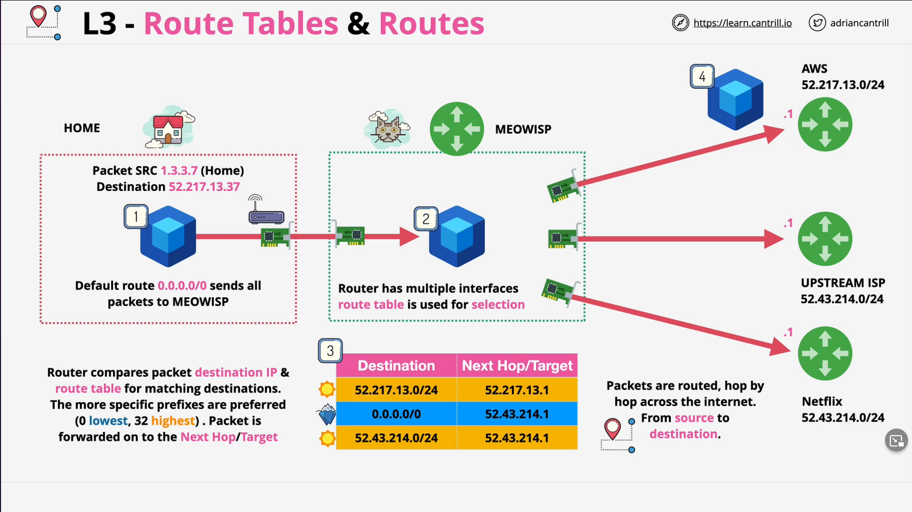
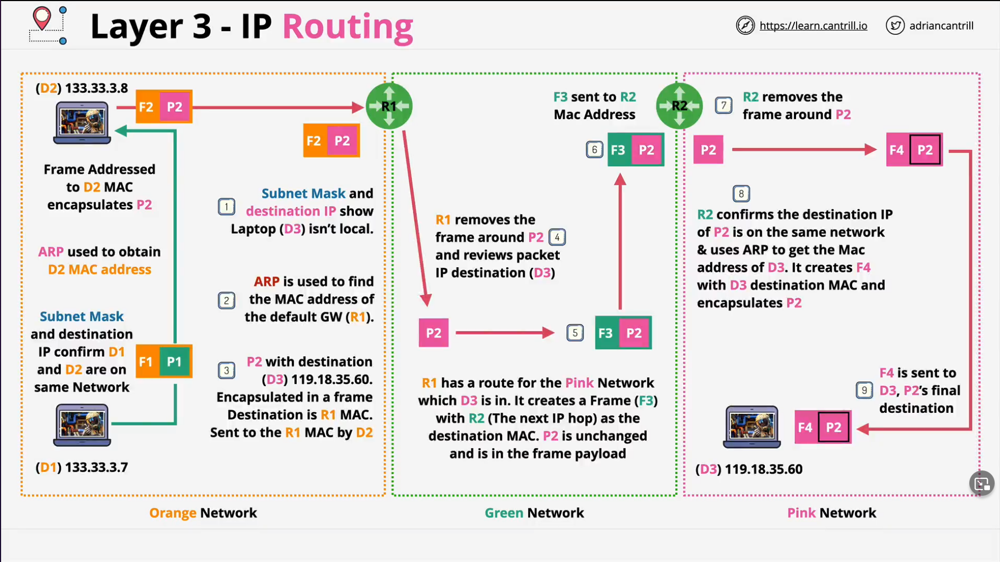

* Using only layer 2, two local area networks joined by a direct point to point link using the SAME layer 2 protocol (i.e. something like Ethernet) could communicate.

* Ethernet is a L2 protocol generally used for local networks. For long distance point to point links, PPP, MPLS, or ATM are often used.

* Layer 3 is a common protocol that can span multiple different Layer 2 networks.
  
  * Internet Protocol (IP) is a Layer-3 protocol which adds cross-network IP addressing and routing to move data between Local Area Networks without direct P2P links.
  * Routers (L3) devices remove frame encapsulation and add new frame encapsulation at every hop.
    * i.e. IP packet is put inside an Ethernet frame for that part of the journey.
    * Why are they stripped away and re-added?
  * Needed to allow connecting to remote networks cross intermediate networks on the way.

IP Packet Structure

* Similar to frames in many ways. They contain some data to be moved and have a source and destination address.
* However, with frames, source/destination are local. With IP packets, source/destination could be on opposite sides of the globe.
* The frame that the IP packet gets encapsulated into is specific to the local network the packet is moving through and changes every time the packet moves between networks. However, the packet does not change.

IP Versions

* Version 4
  * Version
  * Header Length
  * Type Of Service
  * Total Length
  * Identification
  * IP Flags
  * Fragment Offset
  * Time to Live
  * Protocol
  * Header checksum
  * Source IP Address
  * Destination IP Address
  * IPOPTION
  * Data
* Version 6
  * Version
  * Traffic Class
  * Flow Label
  * Payload Length
  * Next Header
  * Hop Limit (similar to TTL)
  * Source IP Address (Much Bigger, larger addresses)
  * Destination IP Address (Much Bigger, larger addresses)
  * Data

IP Addressing (v4) - IPv4

* Example: 133.33.3.7
  * Dotted-decimal notation 4 x 0-255
  * All IP Addresses have a 'network' part and a 'Host' part.
    * 133.33 would be the 'Network' part
    * 3.7 would be the 'Host' part
* If the 'Network' part of two IP addresses match, it means they're on the same IP network. If not, they're on different networks.
* The IP addresses are dotted-decimal for humans but they are actually represented as binary numbers.
  * Each decimal part is an 8 bit binary number.
  * So 4 sets of 8 bits (octets) for a total of 32 bits.
* A /16 prefix, like the example network has, means the first 16 bits of the IP are the network, and the remaining bits are for the hosts.
* IP addresses are either assigned by machines (via DHCP, Dynamic Host Configuration Protocol) or by humans.
* Generally IP addresses need to be unique locally and globally. But especially on the local network.

Subnet Masks

* Configured on Layer 3 interfaces along with IP addresses
* Also generally there is a Default Gateway
  * IP address on the local network where packets are forwarded to generally if the intended destination are not an IP address.
* Subnet masks allow a HOST to determine if an IP address it needs to communicate with is local or remote. This influences if it needs to use a gateway or if it can communicate locally.
* Configured on a host device in addition to an IP address e.g. 255.255.0.0 (and this is the same as a /16 prefix). It represents which part of the IP is for the network. It helps you and, more often, a machine know which part of an IP is which.
* To use a subnet mask, you first have to convert it into binary.

The larger the prefix, the more specific the route (/32 most as in represents 1 IP address, /0 least as in it represents all).

Routing is the process where packets are forwarded or routed hop by hop across the internet from source to destination. Route tables are the things that enable this. They can be statically populated or there are things such as BGP (Border Gateway Protocol) that allow routers to communicate with each other and which networks they know about (which is how the core of the internet functions).

When our ISP router is forwarding the packet to the AWS router, it is forwarding it at Layer 2. It wraps the packet in a frame and has the AWS router MAC address of the destination.

Address Resolution Protocol (ARP)

* Within a local network, data is moved via L2 frames over L1. ARP discovers which MAC address relates to a given IP. This process runs between L2 and L3.
* ARP will use L2 to broadcast ALL F's for "Who has the given destination IP address?"
* ARP software on destination computer responds with "I am this IP address and here's my MAC address"
* The source computer can now build a frame for L2 with this MAC address. Then frame can then be given to L1 and given to L1 on the destination computer. L1 will then hand off the raw data to L2 (Frame) and sees it is destined to itself.
* If the two devices are remote, there many be many L2 frames that are used along the way as hops are made.

IP Routing

* Routers are L3 devices.

Layer 3

* Adds IP addresses (v4 or v6) - cross network addressing
* ARP - Find the MAC address for a given IP
* Route - where to forward a packet
* Route Tables - multiple routes
* Router - moves packets from SRC to DST - Encapsulating in L2 on the way
* Allows Device \<=> Device communications over the internet

Does not provide a method for channels of communication (SRC IP \<=> DST IP only)
Packets could be delivered out of order
