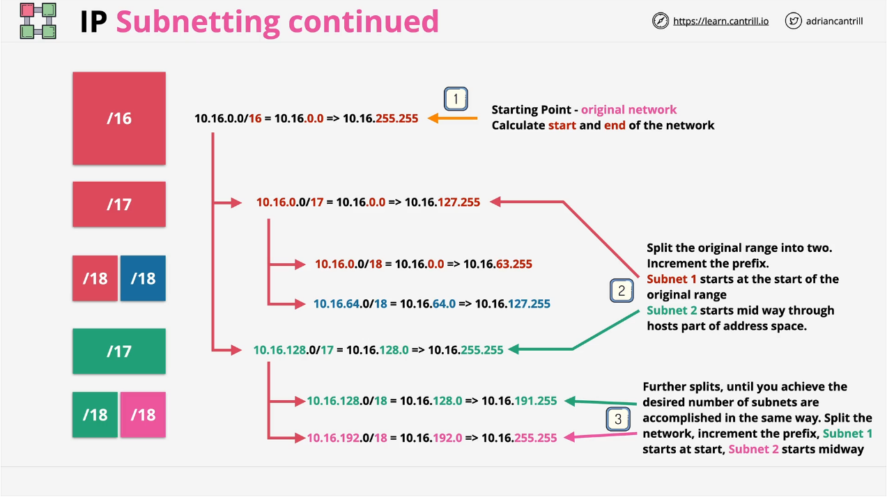

# IP Subnetting

Subnetting is the process of taking a larger network and breaking it down into a larger number of smaller networks (i.e. with a higher prefix).

The larger the prefix value, the smaller the network.

## Example

We have a 10.16.0.0/16 network. This means that the prefix is 10.16 (first two octets) and the addressable portion we can use starts from 0.0 to 255.255 (so 255^2 addresses). However, we want to have 4 networks out of this larger one network.

If we needed to break this network up into two, /16 => 2 * /17. This means we'd have a 10.16.0.0/17 network and a 10.16.128.0/17 network.

Then let's say we want to break up the second of the two /17 networks, /17 => 2 * /18. We end up with a 10.16.128.0/18 and 10.16.192.0/18. And then if we want to break up the first /17 network, we'd have 10.16.0.0/18 and 10.16.64.0/18.

The entire internet is a /0 network (i.e. 0.0.0.0/0 matches the entire internet).
- /8 (Class A Network)
- /16 (Class B Network)
- /24 (Class C Network)
- /32 (Single IP Address)

Networks are usually split into 2, 4, 8, ... and while unusual, odd number splits are also valid.

